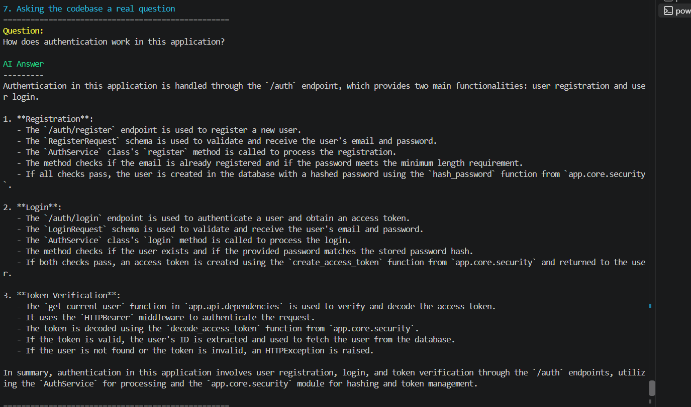

# AI Codebase Intelligence

AI Codebase Intelligence is a backend AI system for indexing, searching, and understanding software repositories.

It combines lexical retrieval, semantic search, reranking, RAG, background processing, caching, and MCP tools so developers can ask questions about a codebase and get answers grounded in the actual source files.

## Why it exists

Understanding an unfamiliar repository usually means manually searching files, following imports, and tracing how different parts of the system connect.

This project reduces that work by indexing the repository once and making the code searchable through natural-language questions.

Instead of sending an entire repository to an LLM, the system retrieves only the most relevant code and gives that context to the model.

## Key Features

- BM25 lexical search
- Semantic search with embeddings
- Pinecone vector storage
- Reciprocal Rank Fusion
- Cross-encoder reranking
- RAG answers grounded in source code
- File and line-range citations
- JWT authentication
- PostgreSQL persistence
- Redis caching
- Celery background indexing
- MCP tools for AI clients
- Retrieval evaluation with Hit@5 and MRR@5
- Docker Compose environment

## How It Works

```text
Repository
    |
    v
Ingestion
    |
    v
Chunking + Structured Metadata
    |
    +-----------------------+
    |                       |
    v                       v
BM25 Search          Semantic Embeddings
                            |
                            v
                         Pinecone
    |                       |
    +-----------+-----------+
                |
                v
       Reciprocal Rank Fusion
                |
                v
       Cross-Encoder Reranker
                |
                v
          Relevant Context
                |
                v
             Ollama
                |
                v
      Grounded Answer + Citations
```

Repository indexing runs asynchronously:

```text
FastAPI
   |
   v
 Redis
   |
   v
Celery Worker
   |
   +--> Ingestion
   +--> Chunking
   +--> Metadata Extraction
   +--> Embedding / Pinecone Indexing
```

Redis is also used to cache repeated RAG responses.

## Demo

AI Codebase Intelligence indexes a repository and lets you ask questions about the code using a grounded RAG pipeline.



### What the demo shows

The demo runs the full pipeline:

`FastAPI → PostgreSQL → Redis → Celery → Ingestion → Chunking → Embeddings → Pinecone → BM25 + Semantic Search → RRF → Cross-Encoder Reranking → Ollama RAG → Source Citations → Redis Cache`

The example asks:

> **How does authentication work in this application?**

The system retrieves the relevant implementation, generates an answer using the retrieved code, and returns source citations such as `app/api/auth.py`, `app/services/auth.py`, `app/api/dependencies.py`, and `app/core/security.py`.

The same question is then submitted again to demonstrate Redis caching, returning `cache_hit: true`.

### Video Demo

[Watch the full terminal demo](docs/demo.mp4)

## Retrieval Pipeline

The project uses multiple retrieval strategies rather than relying only on vector search.

### BM25

BM25 is used for lexical retrieval.

It performs well when queries contain exact identifiers, function names, variable names, or terminology used directly in the code.

Example:

```text
decode_access_token
```

### Semantic Search

Code chunks are converted into embeddings and indexed in Pinecone.

A natural-language question is embedded using the same model and compared against the indexed vectors.

This allows the system to find relevant code even if the user's wording is different from the implementation.

Example:

```text
Where does the application check whether a user is logged in?
```

### Reciprocal Rank Fusion

BM25 and semantic search return different score types, so their raw scores are not directly comparable.

RRF combines the two ranked lists using result positions instead.

### Cross-Encoder Reranking

The fused candidates are passed through a cross-encoder reranker.

The reranker evaluates the query and code candidate together and produces the final result ordering.

The best-ranked chunks are then passed to the LLM.

## Retrieval Evaluation

I created a small ground-truth evaluation set and compared the retrieval approaches using Hit@5 and MRR@5.

| Retrieval Method | Hit@5 | MRR@5 |
| --- | ---: | ---: |
| BM25 | 0.750 | 0.500 |
| Semantic | 1.000 | 0.854 |
| Hybrid RRF | 0.875 | 0.692 |
| RRF + Reranker | **1.000** | **0.875** |

The evaluation showed that adding more retrieval components did not automatically improve retrieval.

Equal-weight RRF performed worse than semantic search by itself.

After adding cross-encoder reranking, the final pipeline maintained a Hit@5 of `1.000` and improved MRR@5 from `0.854` to `0.875`.

This is why the final RAG pipeline uses reranked retrieval.

## RAG Flow

```text
Question
   |
   v
BM25 + Semantic Retrieval
   |
   v
RRF Candidate Fusion
   |
   v
Cross-Encoder Reranking
   |
   v
Top Code Chunks
   |
   v
Prompt Construction
   |
   v
Local LLM
   |
   v
Answer + Source Metadata
```

The model is instructed to answer only from the retrieved context and avoid inventing files, functions, classes, or behavior.

A response includes the source files and line ranges used during retrieval.

## Example

Input:

```text
How does authentication work in this application?
```

The system can retrieve code from files such as:

```text
app/api/dependencies.py
app/core/security.py
app/api/auth.py
app/services/auth.py
```

The LLM then receives only those relevant chunks and generates a grounded explanation of the authentication flow.

The response also includes metadata such as:

```text
path: app/core/security.py
start_line: 1
end_line: 57
```

## Background Processing

Repository indexing can take longer than a normal API request because it involves:

- reading repository files
- chunking source code
- extracting structured metadata
- generating embeddings
- indexing vectors in Pinecone

These operations are processed asynchronously using Celery.

The API creates a background task and immediately returns a job ID.

Redis acts as the Celery broker and result backend.

The worker then performs:

```text
Ingestion
   |
   v
Chunking
   |
   v
Metadata Extraction
   |
   v
Embedding Generation
   |
   v
Pinecone Indexing
```

Clients can query the job status endpoint to monitor progress.

## Caching

Redis is also used to cache RAG responses.

The cache key is generated from:

```text
repository
query
top_k
```

The first request runs the full retrieval and generation pipeline:

```text
Question
   |
   v
Cache Miss
   |
   v
Retrieval
   |
   v
Reranking
   |
   v
LLM
   |
   v
Store Result
```

An identical request can return directly from Redis:

```text
Question
   |
   v
Cache Hit
   |
   v
Cached Response
```

## MCP

The project includes a Model Context Protocol server.

It exposes read-only tools that allow compatible AI clients to interact with indexed repositories.

Available tools:

```text
search_code
get_file
list_symbols
ask_codebase
```

### search_code

Search an indexed repository using the retrieval pipeline.

### get_file

Retrieve an indexed source file.

### list_symbols

Inspect structured symbols extracted from the repository.

### ask_codebase

Ask a grounded RAG question about a repository.

The MCP interface is intentionally read-only.

It does not expose arbitrary shell execution or unrestricted file modification.

## Tech Stack

### Backend

- Python
- FastAPI
- SQLAlchemy
- PostgreSQL
- Pydantic
- Alembic

### AI and Retrieval

- Sentence Transformers
- Pinecone
- BM25
- Reciprocal Rank Fusion
- Cross-Encoder reranking
- Ollama

### Infrastructure

- Docker
- Docker Compose
- Redis
- Celery

### Integration

- Model Context Protocol

### Testing and Evaluation

- Pytest
- Hit@5
- MRR@5

## Quick Start

### Requirements

Install:

- Docker
- Docker Compose
- Ollama

You also need a Pinecone API key.

### 1. Clone the repository

```bash
git clone YOUR_REPOSITORY_URL
cd AI-Codebase-Intelligence
```

### 2. Create `.env`

Use `.env.example` as the template.

Required configuration includes:

```env
DATABASE_URL=postgresql://postgres:postgres@db:5432/codebase_intelligence

PINECONE_API_KEY=your_pinecone_api_key
PINECONE_INDEX_NAME=codebase-intelligence

OLLAMA_URL=http://host.docker.internal:11434
OLLAMA_MODEL=qwen2.5-coder:3b

REDIS_URL=redis://redis:6379/0
RAG_CACHE_TTL_SECONDS=900

JWT_SECRET_KEY=your_random_secret
JWT_ALGORITHM=HS256
ACCESS_TOKEN_EXPIRE_MINUTES=60
```

Generate a JWT secret with:

```bash
python -c "import secrets; print(secrets.token_urlsafe(64))"
```

Never commit `.env`.

### 3. Start Ollama

Pull the configured model:

```bash
ollama pull qwen2.5-coder:3b
```

Make sure Ollama is running.

### 4. Start the stack

```bash
docker compose up --build -d
```

Check the services:

```bash
docker compose ps
```

You should see:

```text
API
PostgreSQL
Redis
Celery Worker
```

### 5. Run migrations

```bash
docker compose exec api alembic upgrade head
```

### 6. Open Swagger

```text
http://localhost:8000/docs
```

From Swagger you can:

- register/login
- create repositories
- start indexing jobs
- run semantic search
- run BM25 search
- run hybrid search
- run reranked search
- ask RAG questions
- inspect job status

## Run Tests

```bash
docker compose exec api pytest -q
```

## Run Retrieval Evaluation

```bash
docker compose exec api python -m evaluation.evaluate_retrieval
```

Expected evaluation output for the current benchmark:

```text
bm25       Hit@5=0.750 MRR@5=0.500
semantic   Hit@5=1.000 MRR@5=0.854
hybrid     Hit@5=0.875 MRR@5=0.692
reranked   Hit@5=1.000 MRR@5=0.875
```

## Terminal Demo

The strongest demo for this project is:

```text
Start repository indexing
        |
        v
Wait for Celery job
        |
        v
Ask a codebase question
        |
        v
Show grounded answer
        |
        v
Show source paths + line ranges
        |
        v
Repeat query
        |
        v
Show Redis cache hit
```

A good question to demonstrate is:

```text
How does authentication work in this application?
```

This shows the full project rather than only one component:

```text
FastAPI
Redis
Celery
PostgreSQL
BM25
Semantic Search
Pinecone
RRF
Reranker
Ollama
RAG
Caching
```

## Recording the Demo

Use OBS Studio or ScreenToGif.

Before recording:

1. Start Ollama.
2. Start Docker Compose.
3. Make sure the repository has already built at least once.
4. Open PowerShell in the repository root.
5. Increase the terminal font size so output is readable.

Record only the important workflow.

Avoid recording long model downloads or Docker builds.

A good final video should be around 30–60 seconds.

Show:

```text
background indexing job
question
grounded answer
source files
line ranges
cache hit
```

You can place the GIF or video near the top of this README after recording it.

## Security

- Passwords are hashed before storage.
- JWT authentication protects private endpoints.
- JWT secrets are loaded from environment variables.
- Repository access is restricted to the owning user.
- `.env` is excluded from version control.
- MCP tools are read-only.
- The LLM is instructed to answer from retrieved code context.

## What I Learned

The main lesson from this project was that building a RAG system involves much more than connecting an embedding model to an LLM.

Retrieval quality had to be measured rather than assumed.

The first hybrid retrieval implementation was more complex than semantic retrieval but performed worse on the evaluation set.

Building an evaluation pipeline exposed that problem.

Adding cross-encoder reranking improved the final ranking and gave a measurable reason to use the more complex retrieval pipeline.

The project also required building the engineering around the AI components:

- authentication
- persistent storage
- background jobs
- caching
- vector infrastructure
- API design
- testing
- configuration
- MCP tool access

The final result is a system where the LLM is one component inside a larger backend AI architecture.